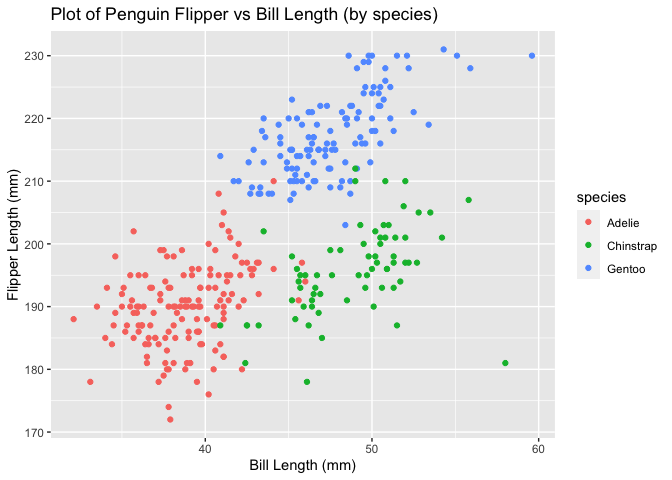

p8105_hw1_sjz2120
================
2022-09-19

# Prep work

``` r
library(tidyverse)
```

    ## ── Attaching packages ─────────────────────────────────────── tidyverse 1.3.2 ──
    ## ✔ ggplot2 3.3.6      ✔ purrr   0.3.4 
    ## ✔ tibble  3.1.8      ✔ dplyr   1.0.10
    ## ✔ tidyr   1.2.0      ✔ stringr 1.4.1 
    ## ✔ readr   2.1.2      ✔ forcats 0.5.2 
    ## ── Conflicts ────────────────────────────────────────── tidyverse_conflicts() ──
    ## ✖ dplyr::filter() masks stats::filter()
    ## ✖ dplyr::lag()    masks stats::lag()

# Problem 1

``` r
install.packages("palmerpenguins")
```

``` r
data("penguins", package = "palmerpenguins")

penguins
```

    ## # A tibble: 344 × 8
    ##    species island    bill_length_mm bill_depth_mm flipper_…¹ body_…² sex    year
    ##    <fct>   <fct>              <dbl>         <dbl>      <int>   <int> <fct> <int>
    ##  1 Adelie  Torgersen           39.1          18.7        181    3750 male   2007
    ##  2 Adelie  Torgersen           39.5          17.4        186    3800 fema…  2007
    ##  3 Adelie  Torgersen           40.3          18          195    3250 fema…  2007
    ##  4 Adelie  Torgersen           NA            NA           NA      NA <NA>   2007
    ##  5 Adelie  Torgersen           36.7          19.3        193    3450 fema…  2007
    ##  6 Adelie  Torgersen           39.3          20.6        190    3650 male   2007
    ##  7 Adelie  Torgersen           38.9          17.8        181    3625 fema…  2007
    ##  8 Adelie  Torgersen           39.2          19.6        195    4675 male   2007
    ##  9 Adelie  Torgersen           34.1          18.1        193    3475 <NA>   2007
    ## 10 Adelie  Torgersen           42            20.2        190    4250 <NA>   2007
    ## # … with 334 more rows, and abbreviated variable names ¹​flipper_length_mm,
    ## #   ²​body_mass_g

## **Describing the penguins dataset**

-   There are 8 variables in this dataset, including: Species, Island,
    Bill Length (in mm), Bill Depth (in mm), Flipper Length (in mm),
    Body Mass (in g), Sex, and Year.

-   The dataset contains 344 rows (observations) and 8 columns
    (variables).

-   The mean flipper length among penguins in this dataset is
    200.9152047 mm.

``` r
##Create scatterplot of flipper length (y) vs bill length (x)
ggplot(penguins, aes(x = bill_length_mm, y = flipper_length_mm, color = species)) + geom_point() + xlab("Bill Length (mm)") + ylab("Flipper Length (mm)") + ggtitle("Plot of Penguin Flipper vs Bill Length (by species)")
```

    ## Warning: Removed 2 rows containing missing values (geom_point).

<!-- -->

``` r
##Save scatterplot to project directory
ggsave("flipper_vs_bill_scatterplot.pdf", height = 4, width = 6)
```

    ## Warning: Removed 2 rows containing missing values (geom_point).

# Problem 2

``` r
problem2_df = tibble(
  rand_samp_10 = rnorm(10),
  greater_zero = c(rand_samp_10 > 0),
  char_vec_10 = c("a", "b", "c", "d", "e", "f", "g", "h", "i", "j"),
  vec_factor_10 = factor(c("high", "medium", "low", "medium","high", "high", "low", "low", "medium", "high"))
)
```

``` r
mean(pull(problem2_df, rand_samp_10))
```

    ## [1] -0.02384985

``` r
mean(pull(problem2_df, greater_zero))
```

    ## [1] 0.6

``` r
mean(pull(problem2_df, char_vec_10))
```

    ## Warning in mean.default(pull(problem2_df, char_vec_10)): argument is not numeric
    ## or logical: returning NA

    ## [1] NA

``` r
mean(pull(problem2_df, vec_factor_10))
```

    ## Warning in mean.default(pull(problem2_df, vec_factor_10)): argument is not
    ## numeric or logical: returning NA

    ## [1] NA

We’re able to take the mean of variables **rand_samp_10** and
**greater_zero** because they are **numeric and logical variable types**
(respectively), meaning that we can take the mean of them.

However, we’re unable to take the mean of **variables char_vec_10** and
**vec_factor_10** because they are character and factor variable types
(respectively). Since neither of them are numeric or logical variable
types, we can’t take the mean of these variables.

``` r
as.numeric(pull(problem2_df, greater_zero))
as.numeric(pull(problem2_df, char_vec_10))
```

    ## Warning: NAs introduced by coercion

``` r
as.numeric(pull(problem2_df, vec_factor_10))
```

For the logical variable **greater_zero,** the FALSE values are recoded
as 0 while the TRUE values are recoded as 1 (thus the variable becomes
numeric).

For the character variable **char_vec_10,** all of the values become
**NA** because there is no way to recode the character values
numerically.

For the factor variable **vec_factor_10,** the three different levels
are recoded as numbers. In this case, “high” was recoded as 1, “medium”
was recoded as 3, and “low” was recoded as 2.

This helps explain what happens when we try to take the mean of each of
these non-numeric variables. For the logical variable **greater_zero,**
we’re able to take the mean because FALSE=0 and TRUE=1 (they can already
be considered numbers).

However, for **char_vec_10** and **vec_factor_10** we are unable to take
their means because their values are not numeric; and only
**vec_factor_10** can be converted to a numeric variable after using
as.numeric.
